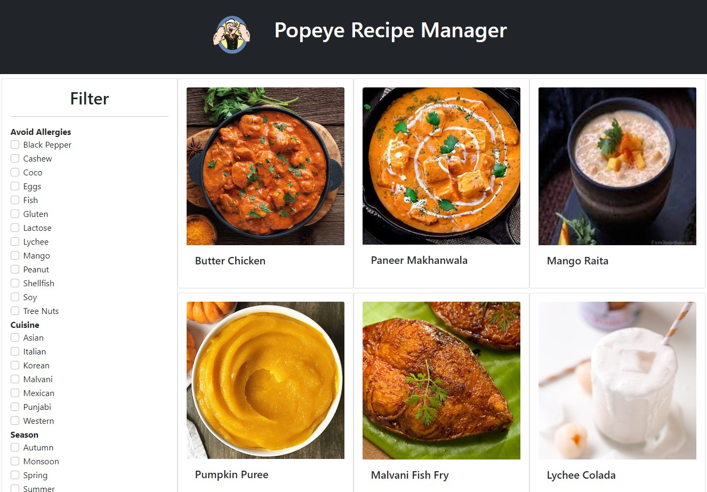
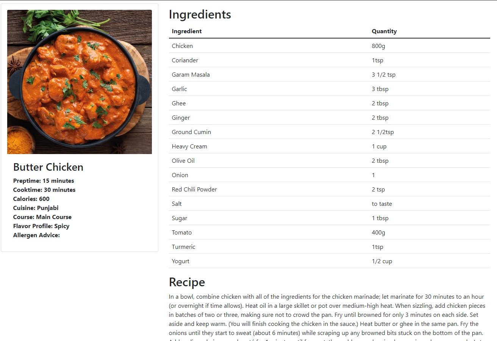

# Popeye Recipe Manager

Django web app which uses MySQL as the backend database, styling done with Bootstrap. Developed as part of an undergraduate assignment.

## Build/Running instructions

1. Install `MySQL` on your system.
2. Clone the repo.
3. Run/Paste the `project1.sql` file in your local mysql shell as the root user to setup a sample database for the application.
4. Provide password for the mysql root user on line 85 of `mysite/settings.py` file, inside the `PASSWORD` field.
5. Run the app by typing `run.bat` in a local terminal in the root directory of the repo.
6. Open `http://127.0.0.1:7000/` in your web browser to use the app.

## Usage Instructions

- By default, the app lists all the recipes in the database.
- You can filter by cuisine/allergies to avoid/flavour profile etc. by the filter boxes on the left and clicking `Apply`.
- You can open the individual dish recipe page by clicking on the dish card.
- Return to the main page at anytime by clicking `Popeye Recipe Manager` at the top of the page.

## Screenshots

\
\

